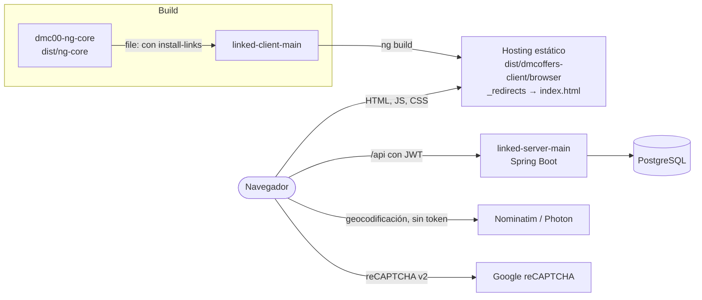

# Despliegue

```mermaid
flowchart LR
  usuario([Navegador]) -->|HTML, JS, CSS| hosting[Hosting estático<br/>dist/dmcoffers-client/browser<br/>_redirects → index.html]
  usuario -->|/api con JWT| backend[linked-server-main<br/>Spring Boot]
  usuario -->|geocodificación, sin token| externos[Nominatim / Photon]
  usuario -->|reCAPTCHA v2| google[Google reCAPTCHA]
  backend --> db[(PostgreSQL)]

  subgraph build[Build]
    ngcore[dmc00-ng-core<br/>dist/ng-core] -->|file: con install-links| app[linked-client-main]
  end
  app -->|ng build| hosting
```
