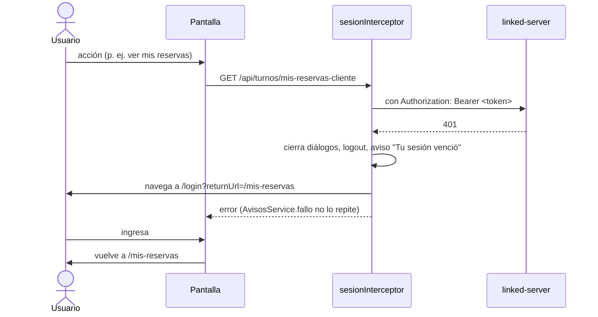
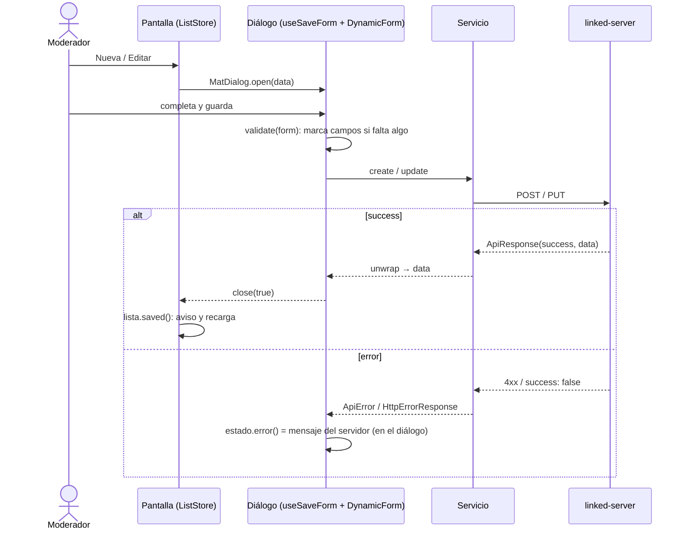
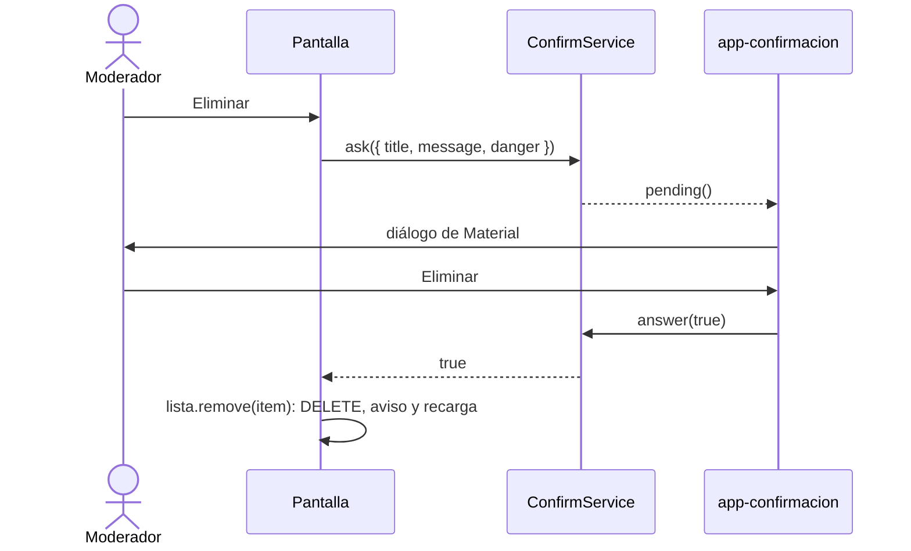

# Secuencias

## Sesión vencida

```mermaid
sequenceDiagram
  actor U as Usuario
  participant P as Pantalla
  participant I as sesionInterceptor
  participant B as linked-server
  U->>P: acción (p. ej. ver mis reservas)
  P->>I: GET /api/turnos/mis-reservas-cliente
  I->>B: con Authorization: Bearer <token>
  B-->>I: 401
  I->>I: cierra diálogos, logout, aviso "Tu sesión venció"
  I->>U: navega a /login?returnUrl=/mis-reservas
  I-->>P: error (AvisosService.fallo no lo repite)
  U->>P: ingresa
  P->>U: vuelve a /mis-reservas
```

## Alta o edición con el diálogo común

```mermaid
sequenceDiagram
  actor A as Moderador
  participant L as Pantalla (ListStore)
  participant D as Diálogo (useSaveForm + DynamicForm)
  participant S as Servicio
  participant B as linked-server
  A->>L: Nueva / Editar
  L->>D: MatDialog.open(data)
  A->>D: completa y guarda
  D->>D: validate(form): marca campos si falta algo
  D->>S: create / update
  S->>B: POST / PUT
  alt success
    B-->>S: ApiResponse(success, data)
    S-->>D: unwrap → data
    D-->>L: close(true)
    L->>L: lista.saved(): aviso y recarga
  else error
    B-->>S: 4xx / success: false
    S-->>D: ApiError / HttpErrorResponse
    D->>D: estado.error() = mensaje del servidor (en el diálogo)
  end
```

## Baja con confirmación

```mermaid
sequenceDiagram
  actor A as Moderador
  participant L as Pantalla
  participant C as ConfirmService
  participant H as app-confirmacion
  A->>L: Eliminar
  L->>C: ask({ title, message, danger })
  C-->>H: pending()
  H->>A: diálogo de Material
  A->>H: Eliminar
  H->>C: answer(true)
  C-->>L: true
  L->>L: lista.remove(item): DELETE, aviso y recarga
```
